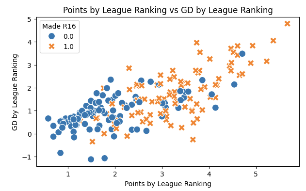
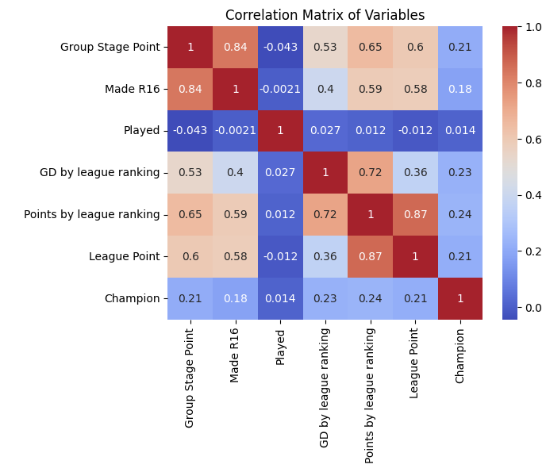

# UEFA Champions League Performance Analysis

## Project Overview
This project explores whether a team's performance during the first half of the season can predict their chances of becoming
UEFA Champions League (UCL) champions. Soccer analytics is a growing field, and this analysis leverages historical data to
draw insights into team success in one of the world's most prestigious soccer tournaments.

### Key Question
Does a team’s first-half performance in their domestic league correlate with their success in the UEFA Champions League?

### Motivation
As a lifelong soccer enthusiast and Manchester United supporter, this project is driven by my passion for the sport and my
curiosity about data-driven decision-making in soccer. Predicting a team's success in the UCL is not just a fascinating
analytical challenge but also critical for clubs aiming to strategize and optimize their resources.

## Data Sources
This analysis uses two primary datasets:

1. Champions League Match Data
- Source: Fixture Download
  - Key columns: Match Number, Round Number, Date, Location, Home Team, Away Team, Group, Result.
  - Covers six seasons from 2017/18 to 2022/23.

2. Custom Domestic League Data
- Source: WhoScored & Official UCL Website (I scrapped the data from the official webpage)
  - Key columns: Team, Games Played (pre-Jan 1), Goal Difference, Points, League Rank.
  - Includes additional features created specifically for this analysis.

## Analysis and Findings
- Methodology
  1. Data Cleaning and Preprocessing:
    - Standardized raw data formats from CSV files.
    - Integrated match data with domestic league data for enriched analysis.

  2. Exploratory Data Analysis (EDA):
    - Visualized key performance indicators (e.g., goals scored, points earned).
    - Analyzed trends across multiple seasons.
  
      

  3. Modeling:
    - Implemented statistical to identify performance predictors.
  
      

- Results
Insights into correlations between domestic league performance and UCL outcomes.
Identification of key metrics that significantly impact a team’s chances of winning the championship.

## Tools and Technologies
- Programming Language: Python
- Libraries: Pandas, NumPy, Matplotlib, Seaborn, Scikit-learn
- Development Environment: Jupyter Notebook
- Version Control: GitHub
